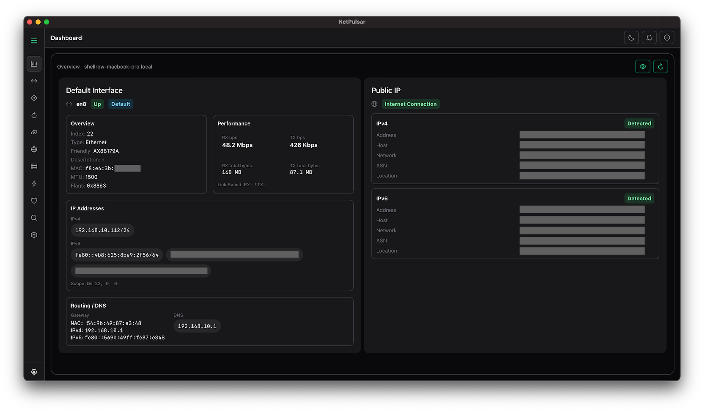
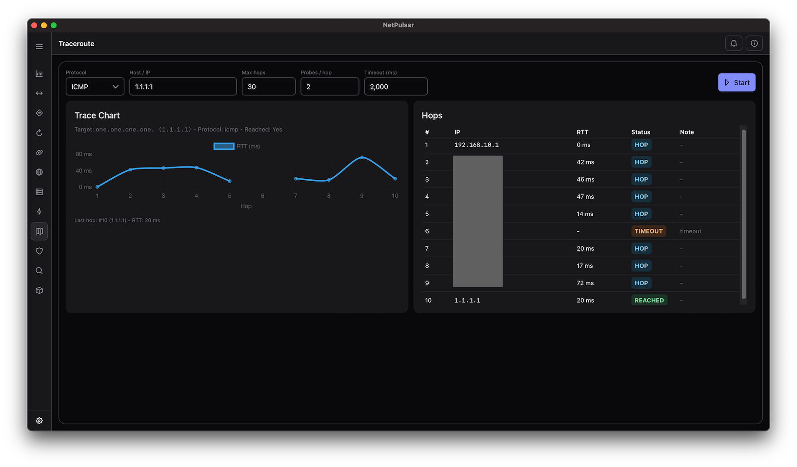
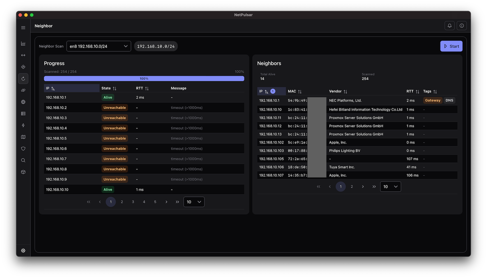

# NetPulsar

<p align="center">
  
</p>

Cross-platform network diagnostic suite built with **Rust** + **Tauri**.  
Inspect, monitor, and analyze your network.


---

## Features

- **Interface Overview** - Active interfaces with IPs, gateways, and real-time stats  
- **Live Traffic Charts** - RX/TX throughput and MIN/AVG/MAX
- **Neighbor Scan** - Discover devices in your local network
- **Net Route** - Inspect routing tables, gateways, and metrics  
- **Socket Connection** - View active TCP/UDP sockets with process information  
- **Public IP Info** - Detect IPv4 / IPv6, ASN, and country  
- **Ping (ICMP / TCP / UDP / QUIC)** - Measure latency and reachability across protocols  
- **Traceroute (ICMP / UDP)** - Per-hop RTT with detailed hop visualization
- **Port Scan** - Detect open ports (Common, Top1000, or custom sets)  
- **Host Scan** - Scan your network to identify alive hosts  
- **Cross-Platform** - macOS, Windows, and Linux supported  

---

## 🚀 Getting Started

### Using Installer
Download the installer for your platform from the [releases page](https://github.com/shellrow/netpulsar/releases).

#### macOS Security
After installing NetPulsar on macOS, you may encounter a security warning that prevents the app from opening, stating that it is from an unidentified developer. This is a common macOS security measure for apps downloaded outside of the App Store.

To resolve this issue and open NetPulsar, you can remove the security attributes that macOS assigns to the application using the following command in the Terminal:

```bash
xattr -rc "/Applications/NetPulsar.app"
```

### 🦀 Build from source
```bash
# 1. Clone the repository
git clone https://github.com/shellrow/netpulsar.git
cd netpulsar

# 2. Install dependencies
cargo install tauri-cli
npm install

# 3. Run in development mode
cargo tauri dev

# 4. Build release package
cargo tauri build
```

## Screenshots



